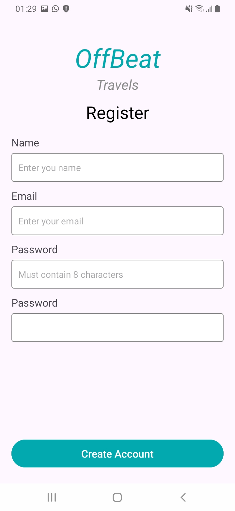
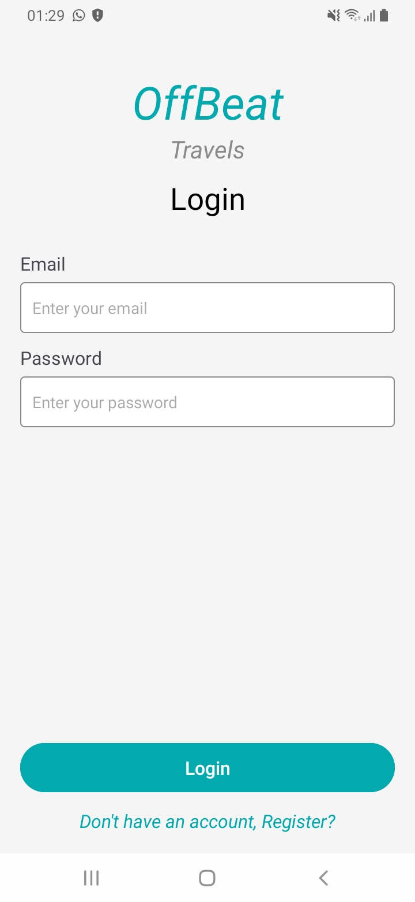
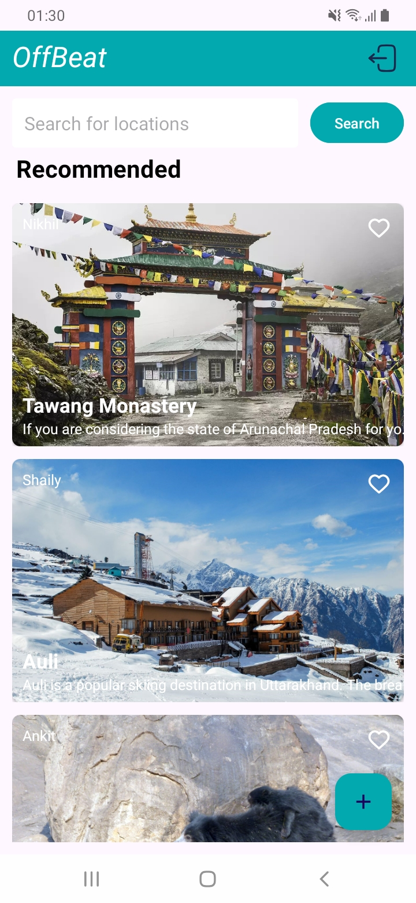
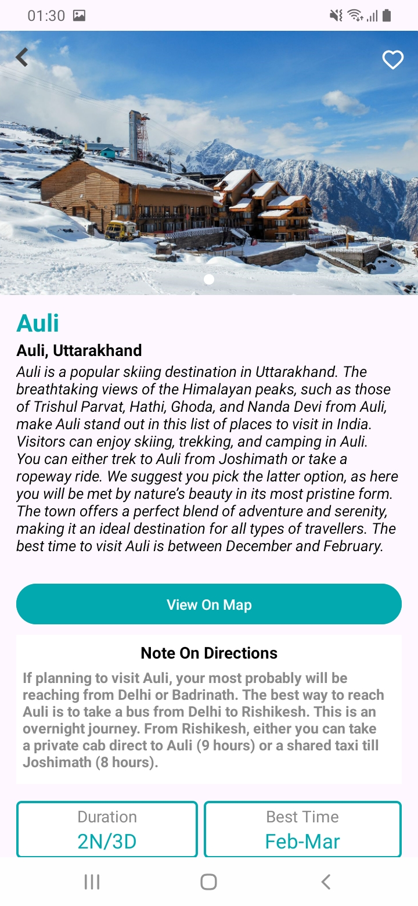
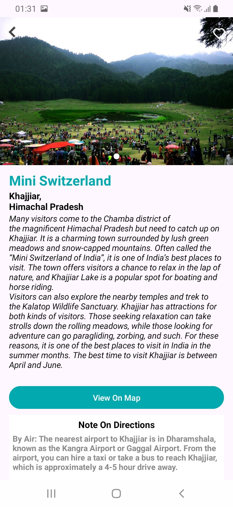
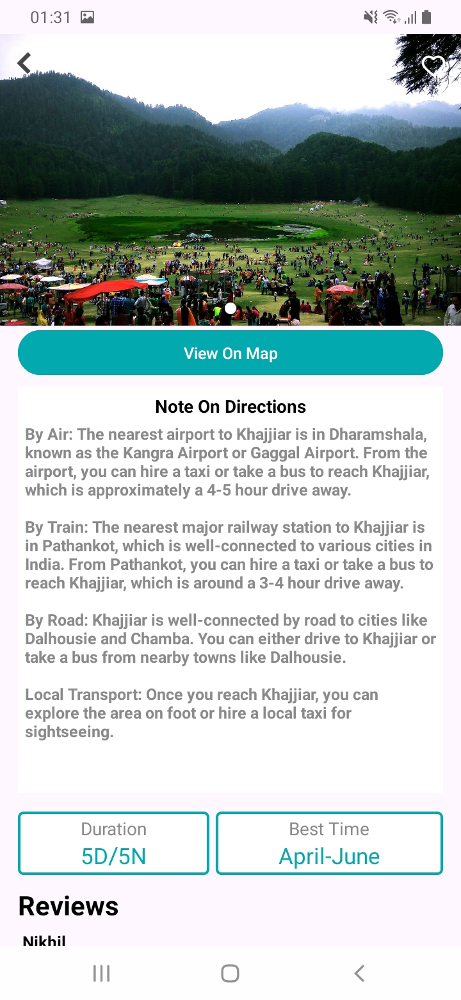
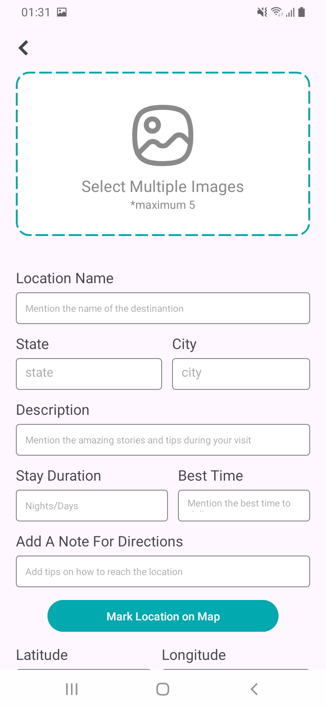
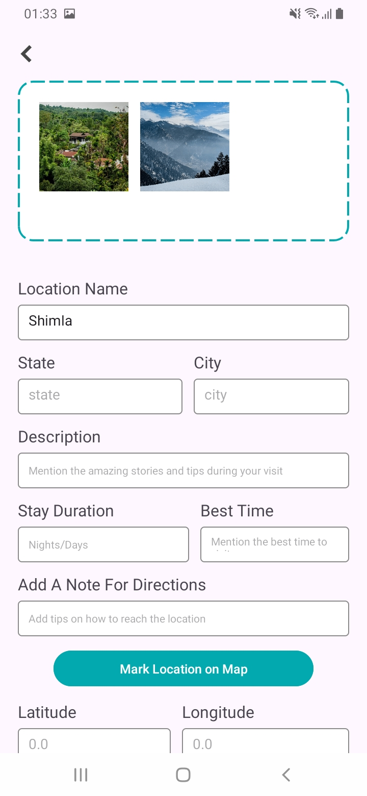
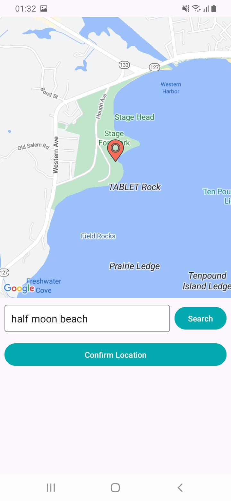
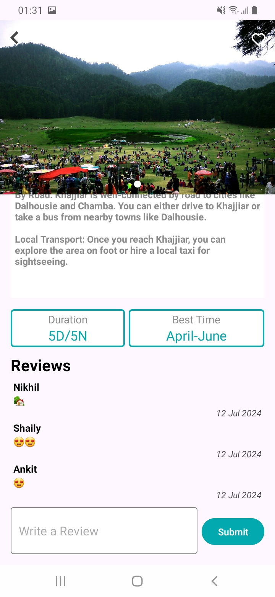

# OffBeat

OffBeat is an Android application designed to help users discover and share offbeat travel locations. Users can view locations, read reviews, add their own reviews and photos of locations they have visited, and even mark locations on the map.

## Features

- **User Authentication**: Users can sign in using their Google accounts.
- **Location Discovery**: Browse through a list of offbeat locations with photos and descriptions.
- **Add Locations**: Users can add details about their findings of offbeat locations.
- **Map Integration**: View locations on Google Maps and mark new locations.
- **Reviews**: Read and submit reviews for locations.
- **Photo Upload**: Upload photos of locations.

## Usage

1. **Sign In**:
    - Open the app and sign in using your Google account.

         
      
         
     
2. **Browse Locations**:
    - View a list of offbeat locations with photos and descriptions.
  
           

3. **View Location Details**:
    - Click on a location to view more details, including reviews and a photo slideshow.

         
         
         
         
          

4. **Add a Location**:
    - Submit details about your own offbeat location findings, including photos and descriptions.
  
      

       

5. **Mark Location on Map**:
    - Mark the location on the map so that other users can view it.
  
       

6. **Add a Review**:
    - Submit your own review for a location.
  
       

7. **View on Map**:
    - Click the "View on Map" button to see the location on Google Maps.

## Tech Stack

- **Programming Language**: Kotlin
- **Architecture**: MVVM (Model-View-ViewModel)
- **UI**: XML Layouts, Android Views, RecyclerView, ViewBinding
- **Networking & Data**: Firebase Firestore for database, Firebase Storage for image storage, Firebase Authentication for user authentication
- **Image Loading**: Glide
- **Image Slideshow**: ImageSlideshow
- **Asynchronous Programming**: Kotlin Coroutines
- **Google Maps**: Google Maps SDK for Android

## Dependencies

- **Firebase**: Authentication, Firestore, and Storage.
- **Glide**: Image loading and caching.
- **ImageSlideshow**: Image slideshow for displaying location photos.
- **Coroutines**: For asynchronous programming.
- **AndroidX**: Core libraries for modern Android development.
